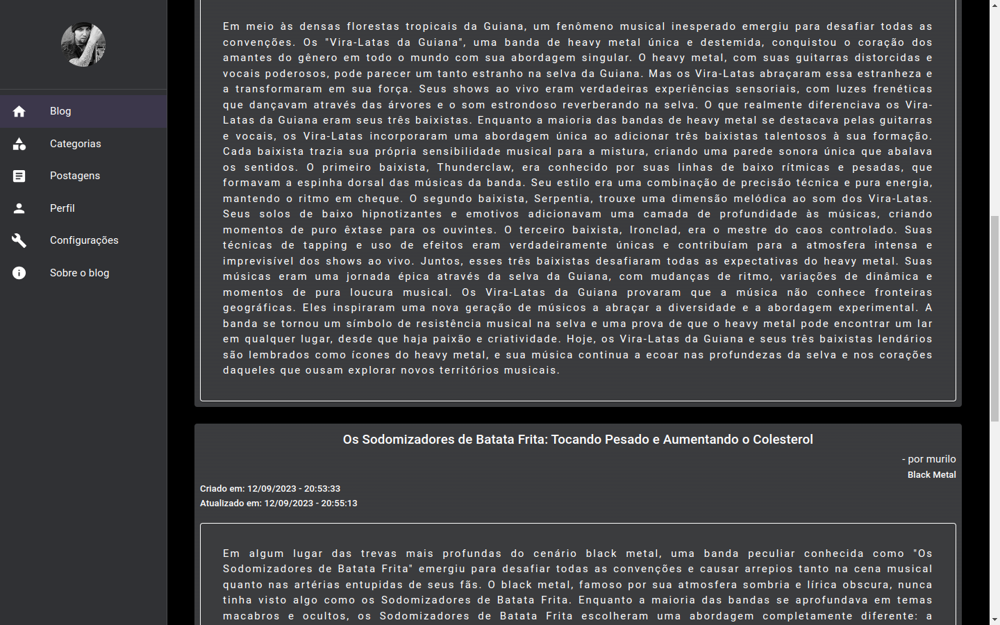

[# Gerencidor de Blog - Lucas Job Viana](https://lucasjobviana.github.io/j_blogposts/)

Olá, este repósitorio é para armazenar o meu projeto blogposts, um gerênciador de postagens para blog. Clique no link acima para acessa-lo. 

## Oque é e como funciona ?

O projeto consiste em um sistema web full-stack para gerenciar blogs. 

Foi desenvolvido para rodar em containers docker. Ao buildar/executar o docker-compose.yml na raiz do projeto, será criado três containers sem nome, utilizando as imagens j_blogposts_frontend, j_blogposts_node e mysql:8.0.23. O banco mysql será criado com o nome blogs-api-dev, com usuário root, porta 3306 e senha: password atraves do sequelize do backend.
A versão de demostração do githubpages só está usando o frontend, todos os dados nessa versão estão sendo salvos no localstorage, para usar a api do backend é preciso alterar o valor da variável usingBD dentro de `frontend/src/shared/tools/mapToDefaultStorage.js`.

## Quais tecnologias foram utilizadas ? 

### Front-End
  - Typescript: React - Componentes Funcionais, React Router Dom, Context API, Unform.
  - Css: Material UI.
### Back-End
  - Node: Express, Sequelize, JSON Web Tokens.
  - Banco de dados: Mysql.
  - Docker

## Tem algum pré-requisito para acessar o projeto ?

- Navegador de internet.
- Docker e docker-compose intalados na máquina.

## Como posso utilizar rodar esse projeto na minha máquina ?

    1. Clone ou fork este repositório.
    2. Navegue até o diretório do projeto: `cd nome-do-projeto`.
    3. Na raiz do projeto, execute o comando: docker-compose up --build.
    4. Acesse `http://localhost:5173/` pelo seu navegador.
    5. Crie um novo usuário e faça login no sistema.

## Capturas

